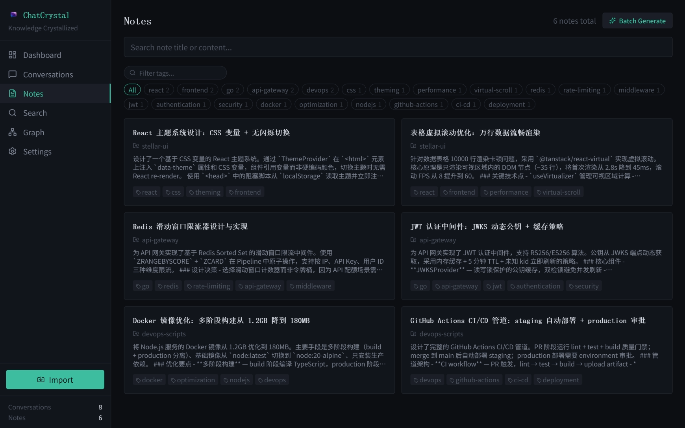
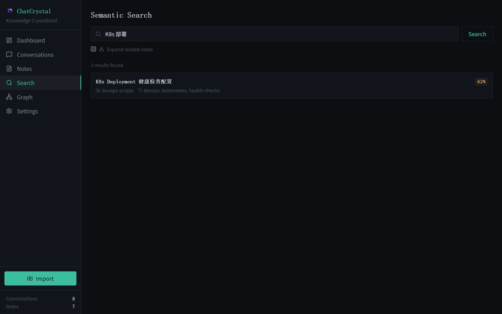
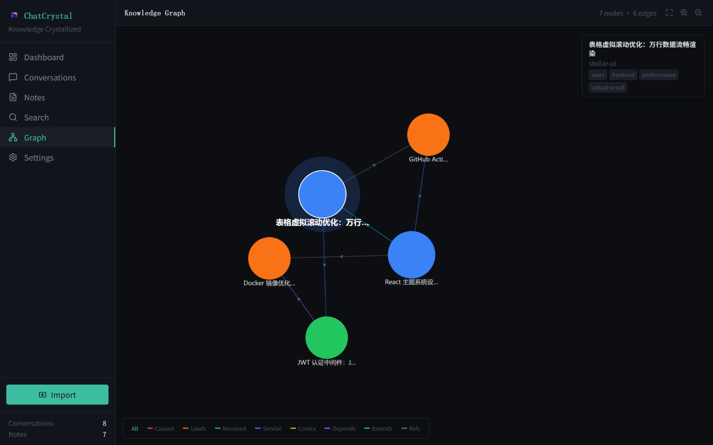

<div align="center">


# ChatCrystal

**Turn your AI conversations into searchable knowledge**

[](https://github.com/ZengLiangYi/ChatCrystal/releases)
[](https://www.npmjs.com/package/chatcrystal)
[](LICENSE)
[](https://nodejs.org/)
[](#)
[](https://zengliangyi.github.io/ChatCrystal/)

English | [简体中文](README.zh-CN.md)

</div>

---

<div align="center">

</div>

<br>

ChatCrystal collects conversations from AI coding tools, distills them into structured notes with LLMs, and builds a local searchable knowledge base from your real problem-solving history.

Supported sources: Claude Code, Cursor, Codex CLI, Trae, and GitHub Copilot.

## Quick Start

### Desktop App (Recommended)

Download the latest Windows installer from [GitHub Releases](https://github.com/ZengLiangYi/ChatCrystal/releases). After installing, launch ChatCrystal, configure your LLM and embedding providers in Settings, then click **Import**.

### CLI / Web

```bash
npm install -g chatcrystal
crystal serve -d
crystal import
```

Then open http://localhost:3721 in your browser.

## What It Does

- **Imports AI coding conversations** from local tool data directories.
- **Distills conversations into structured notes** with titles, summaries, conclusions, snippets, and tags.
- **Searches knowledge semantically** with embeddings and relation-aware result expansion.
- **Builds a knowledge graph** across related notes and decisions.
- **Exposes CLI and MCP tools** so agents can recall and write back reusable experience.
- **Runs locally** with configurable LLM and embedding providers.

## Screenshots

<div align="center">
<table>
<tr>
<td align="center"><strong>Conversations</strong></td>
<td align="center"><strong>Notes</strong></td>
</tr>
<tr>
<td></td>
<td></td>
</tr>
<tr>
<td align="center"><strong>Semantic Search</strong></td>
<td align="center"><strong>Knowledge Graph</strong></td>
</tr>
<tr>
<td></td>
<td></td>
</tr>
</table>
</div>

## Common Commands

```bash
crystal status                          # Server status and DB stats
crystal import [--source claude-code]   # Scan and import conversations
crystal search "query" [--limit 10]     # Semantic search
crystal notes list [--tag X]            # Browse notes
crystal notes get <id>                  # View note detail
crystal summarize --all                 # Batch summarize
crystal config get                      # View config
crystal serve -d                        # Start server in background
crystal serve stop                      # Stop background server
crystal mcp                             # Start MCP stdio server
```

## Documentation

| Topic | English | 简体中文 |
|---|---|---|
| User guide | [docs/USER_GUIDE.md](docs/USER_GUIDE.md) | [docs/USER_GUIDE.zh-CN.md](docs/USER_GUIDE.zh-CN.md) |
| Development | [docs/DEVELOPMENT.md](docs/DEVELOPMENT.md) | [docs/DEVELOPMENT.zh-CN.md](docs/DEVELOPMENT.zh-CN.md) |
| MCP and agents | [docs/MCP.md](docs/MCP.md) | [docs/MCP.zh-CN.md](docs/MCP.zh-CN.md) |
| Experience quality gate | [docs/EXPERIENCE_GATE.md](docs/EXPERIENCE_GATE.md) | [docs/EXPERIENCE_GATE.zh-CN.md](docs/EXPERIENCE_GATE.zh-CN.md) |
| Agent skills | [docs/agent-skills.md](docs/agent-skills.md) | [docs/agent-skills.zh-CN.md](docs/agent-skills.zh-CN.md) |

## Requirements

- Node.js >= 20
- An LLM provider for summarization
- An embedding provider for semantic search

LLM and embedding providers are configured separately. Large language models such as Claude, GPT, and Qwen are not embedding models. See the [user guide](docs/USER_GUIDE.md#configuration) for provider examples.

## Local Development

```bash
git clone https://github.com/ZengLiangYi/ChatCrystal.git
cd ChatCrystal
npm install
npm run dev
```

Development server ports:

- API/server: http://localhost:3721
- Vite client: http://localhost:13721

See [docs/DEVELOPMENT.md](docs/DEVELOPMENT.md) for architecture, testing, build, and release details.

## License

[MIT](LICENSE)
