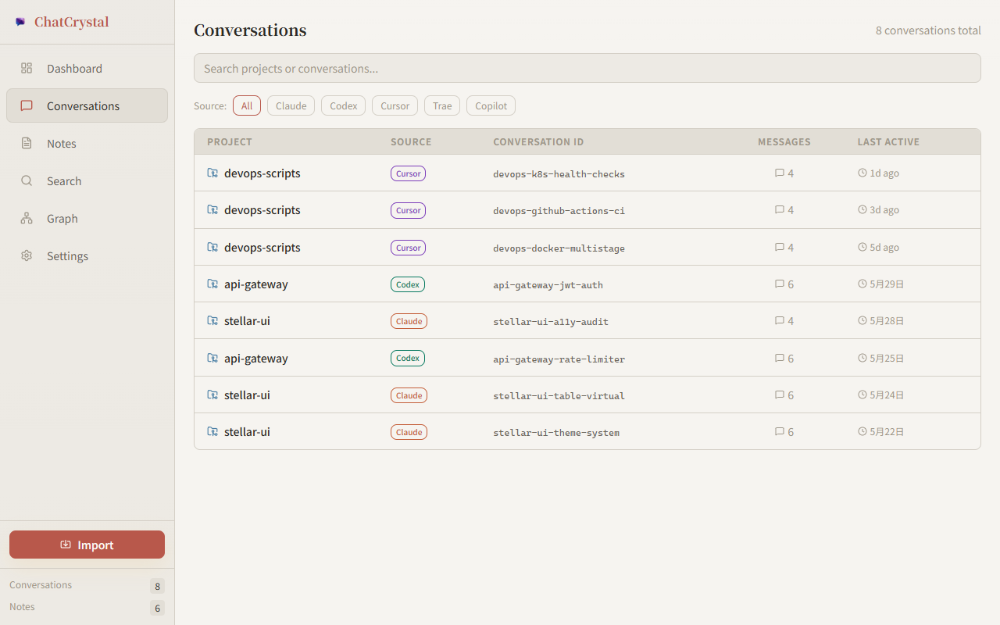
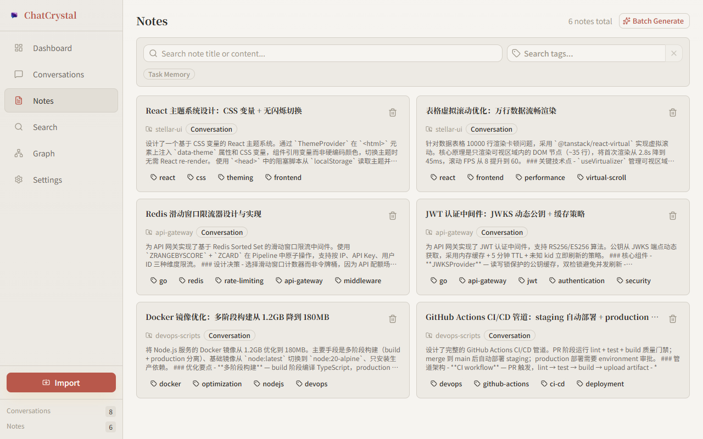
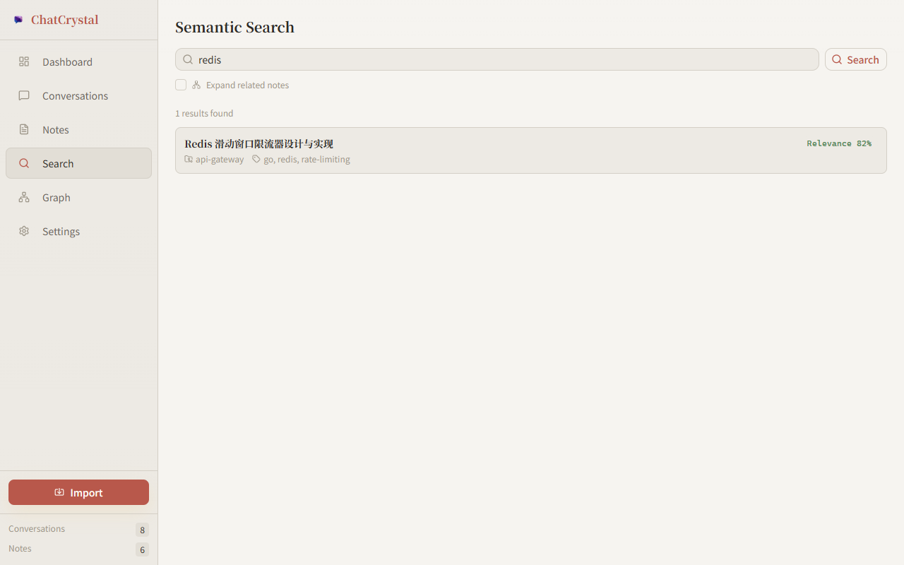
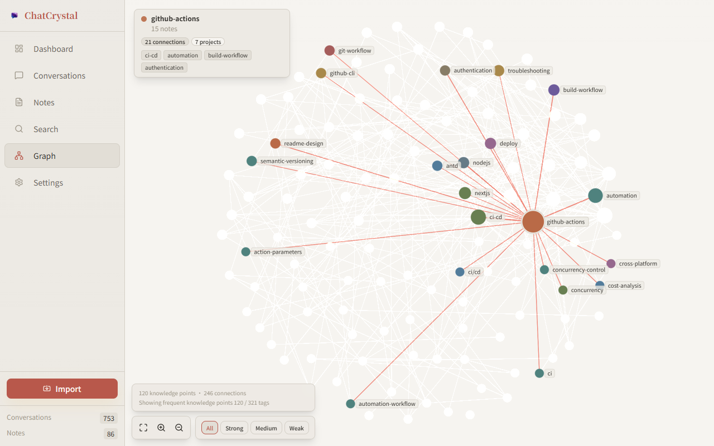

<div align="center">


# ChatCrystal

**Local-first AI PKM for coding conversations**

[](https://github.com/ZengLiangYi/ChatCrystal/releases)
[](https://www.npmjs.com/package/chatcrystal)
[](https://glama.ai/mcp/servers/ZengLiangYi/ChatCrystal)
[](LICENSE)
[](https://nodejs.org/)
[](#)
[](https://zengliangyi.github.io/ChatCrystal/)

[Website](https://zengliangyi.github.io/ChatCrystal/) ·
[Download Desktop](https://github.com/ZengLiangYi/ChatCrystal/releases) ·
[npm](https://www.npmjs.com/package/chatcrystal) ·
[Docs](docs/USER_GUIDE.md) ·
[简体中文](README.zh-CN.md)

</div>

---

<div align="center">

</div>

<br>

ChatCrystal is a local-first AI PKM app for developers who solve real problems with Claude Code, Cursor, Codex CLI, Trae, and GitHub Copilot.

It turns scattered AI coding conversations into structured notes, semantic search, a tag knowledge graph, Markdown exports, and MCP memory your agents can reuse. If this fits your workflow, a star helps more builders find a private, local-first way to keep their AI work memory.

## Quick Start

### Desktop App (Recommended)

Download the latest Windows installer from [GitHub Releases](https://github.com/ZengLiangYi/ChatCrystal/releases). After installing, launch ChatCrystal, configure your LLM and embedding providers in Settings, then click **Import**.

### CLI / Web

```bash
npm install -g chatcrystal
crystal serve -d
crystal import
```

Then open http://localhost:3721 in your browser.

### Docker Cloud

Prefer self-hosting ChatCrystal for multiple devices? See [Docker Cloud Deployment](#docker-cloud-deployment) after the product overview.

## What It Does

- **Imports AI coding conversations** from local tool data directories.
- **Distills conversations into structured notes** with titles, summaries, conclusions, snippets, and tags.
- **Searches knowledge semantically** with embeddings and relation-aware result expansion.
- **Builds a tag knowledge graph** where knowledge points are tags and edges show normalized co-occurrence.
- **Exposes CLI and MCP tools** so agents can recall and write back reusable experience.
- **Runs locally** with configurable LLM and embedding providers.

## Screenshots

<div align="center">
<table>
<tr>
<td align="center"><strong>Conversations</strong></td>
<td align="center"><strong>Notes</strong></td>
</tr>
<tr>
<td></td>
<td></td>
</tr>
<tr>
<td align="center"><strong>Semantic Search</strong></td>
<td align="center"><strong>Knowledge Graph</strong></td>
</tr>
<tr>
<td></td>
<td></td>
</tr>
</table>
</div>

## Common Commands

```bash
crystal status                          # Server status and DB stats
crystal import [--source claude-code]   # Scan and import conversations
crystal search "query" [--limit 10]     # Semantic search
crystal notes list [--tag X]            # Browse notes
crystal notes get <id>                  # View note detail
crystal summarize --all                 # Batch summarize
crystal config get                      # View config
crystal serve -d                        # Start server in background
crystal serve stop                      # Stop background server
crystal mcp                             # Start MCP stdio server
```

## Documentation

| Topic | English | 简体中文 |
|---|---|---|
| User guide | [docs/USER_GUIDE.md](docs/USER_GUIDE.md) | [docs/USER_GUIDE.zh-CN.md](docs/USER_GUIDE.zh-CN.md) |
| Development | [docs/DEVELOPMENT.md](docs/DEVELOPMENT.md) | [docs/DEVELOPMENT.zh-CN.md](docs/DEVELOPMENT.zh-CN.md) |
| MCP and agents | [docs/MCP.md](docs/MCP.md) | [docs/MCP.zh-CN.md](docs/MCP.zh-CN.md) |
| Experience quality gate | [docs/EXPERIENCE_GATE.md](docs/EXPERIENCE_GATE.md) | [docs/EXPERIENCE_GATE.zh-CN.md](docs/EXPERIENCE_GATE.zh-CN.md) |
| Agent skills | [docs/agent-skills.md](docs/agent-skills.md) | [docs/agent-skills.zh-CN.md](docs/agent-skills.zh-CN.md) |

## Requirements

- Node.js >= 20
- An LLM provider for summarization
- An embedding provider for semantic search

LLM and embedding providers are configured separately. Large language models such as Claude, GPT, and Qwen are not embedding models. See the [user guide](docs/USER_GUIDE.md#configuration) for provider examples.

ChatCrystal includes first-class [OrcaRouter](https://www.orcarouter.ai/ref/ref_67516d927343232775e2) support for LLM generation. OrcaRouter is OpenAI-compatible; its Base URL is built in, so enter only your API Key and use **Settings** to fetch and select an available model.

## Local Development

```bash
git clone https://github.com/ZengLiangYi/ChatCrystal.git
cd ChatCrystal
npm install
npm run dev
```

Development server ports:

- API/server: http://localhost:3721
- Vite client: http://localhost:13721

See [docs/DEVELOPMENT.md](docs/DEVELOPMENT.md) for architecture, testing, build, and release details.

## Docker Cloud Deployment

The default Compose deployment runs only the ChatCrystal service. It stores data in the `chatcrystal-data` volume mounted at `/data` inside the container.

```bash
git clone https://github.com/ZengLiangYi/ChatCrystal.git
cd ChatCrystal
docker compose up -d
```

The default `docker-compose.yml` pulls `ghcr.io/zengliangyi/chatcrystal:latest` from GitHub Container Registry. Set `CHATCRYSTAL_IMAGE_TAG` to pin a published version. To build from source instead, run `docker compose -f docker-compose.yml -f docker-compose.build.yml up -d --build`.

To update an existing Docker deployment, run `docker compose pull && docker compose up -d`. Maintainers only: after the first GHCR publish, make the `ghcr.io/zengliangyi/chatcrystal` package public in GitHub Packages; the release workflow verifies anonymous pull access before passing.

Compose binds ChatCrystal to `0.0.0.0:3721` by default so other devices can reach the cloud core through the host IP. Set `CHATCRYSTAL_HOST_PORT` to change the host port, or set `BIND_ADDRESS=127.0.0.1` when a local-only reverse proxy fronts it. For public cloud access, an HTTPS reverse proxy is recommended for safer token transport.

On Windows Docker Desktop, a published port may still need extra host networking configuration before it is reachable through the host LAN IP. For cloud-mode testing, verify `http://<host-ip>:<host-port>/api/health` from the client device first; if it cannot connect, configure Windows port forwarding/firewall rules or deploy the cloud core on a real remote host.

On first start without `CHATCRYSTAL_API_TOKEN`, open the Web UI and enter the setup code printed in container logs or stored at `/data/setup-code`, then choose one shared API token for your devices.

To rotate or reset the Docker cloud token:

```bash
# If you still know the current token, rotate it online.
crystal --base-url https://chatcrystal.example.com token rotate "new-long-token-at-least-16-chars" --current "old-token"
crystal connect https://chatcrystal.example.com --token "new-long-token-at-least-16-chars"

# If you forgot the token and did not set CHATCRYSTAL_API_TOKEN, reset stored auth in the container.
docker compose exec chatcrystal crystal token reset --yes
docker compose logs chatcrystal --tail=80
docker compose exec chatcrystal cat /data/setup-code
```

If your deployment sets `CHATCRYSTAL_API_TOKEN`, that environment variable is the active token source. Change it in your `.env` or Compose environment and recreate the container with `docker compose up -d --force-recreate`.

To use an existing Ollama or external API, configure provider URLs in the Web UI or environment. In Docker, `localhost` means inside the container; use `CHATCRYSTAL_DOCKER_LLM_BASE_URL` and `CHATCRYSTAL_DOCKER_EMBEDDING_BASE_URL` for Compose-time provider URL overrides. Docker Desktop can reach host Ollama at `http://host.docker.internal:11434`, or you can use a remote HTTPS/OpenAI-compatible API.

### Import from a Device into the Cloud Instance

Install or run the CLI on the device that has Claude Code, Cursor, Codex CLI, Trae, or GitHub Copilot history:

```bash
crystal connect https://chatcrystal.example.com --token "your-long-token"
crystal import --yes
```

The CLI scans local histories, parses them locally, and uploads normalized conversations to the cloud. The cloud never scans your local filesystem. Imported conversations are not summarized automatically; use the Web UI or `crystal summarize --all` when you are ready. HTTPS is recommended for cloud access, but HTTP works when that is the deployment you choose.

## Contact Us


## License

[Apache License 2.0](LICENSE)
