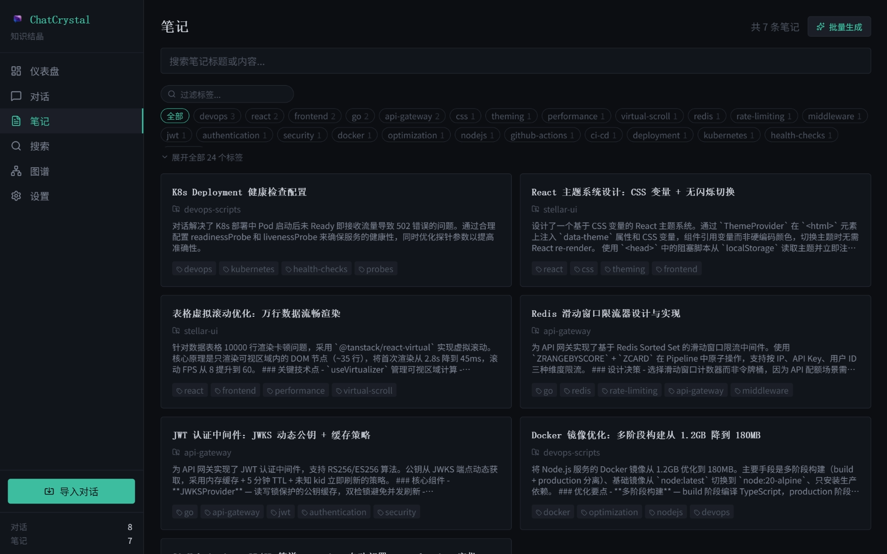
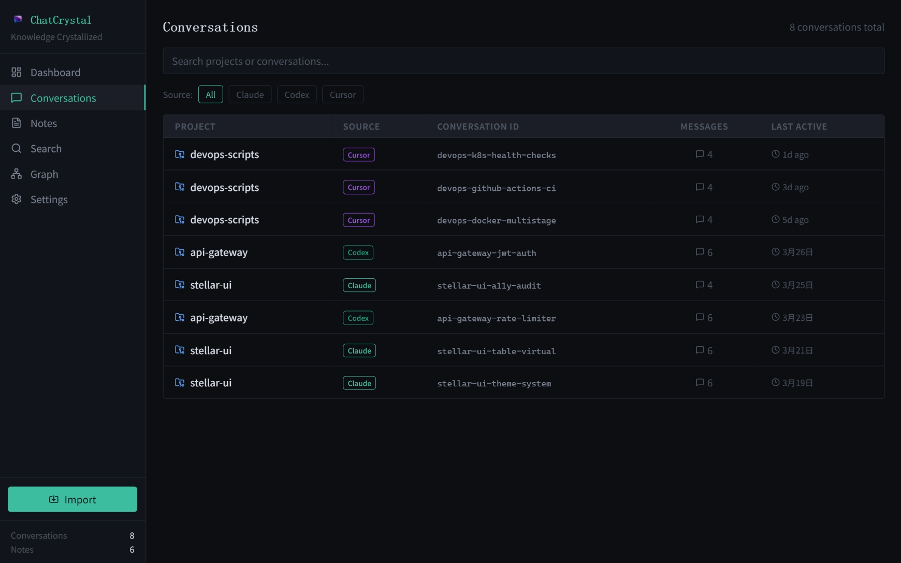

<div align="center">


# ChatCrystal

**从 AI 对话中提炼可搜索的知识库**

[](https://github.com/ZengLiangYi/ChatCrystal/releases)
[](https://www.npmjs.com/package/chatcrystal)
[](LICENSE)
[](https://nodejs.org/)
[](#)
[](https://zengliangyi.github.io/ChatCrystal/zh/)

[English](README.md) | 简体中文

</div>

---

<div align="center">

</div>

<br>

ChatCrystal 会采集 AI 编程工具中的本地对话，用 LLM 提炼为结构化笔记，并基于真实问题解决过程建立一个可搜索的本地知识库。

支持的数据源：Claude Code、Cursor、Codex CLI、Trae、GitHub Copilot。

## 快速开始

### 桌面应用（推荐）

从 [GitHub Releases](https://github.com/ZengLiangYi/ChatCrystal/releases) 下载最新 Windows 安装包。安装后启动 ChatCrystal，在设置页配置 LLM 和 Embedding Provider，然后点击 **Import**。

### CLI / Web

```bash
npm install -g chatcrystal
crystal serve -d
crystal import
```

然后在浏览器打开 http://localhost:3721。

## 它能做什么

- **导入 AI 编程对话**，从本地工具数据目录扫描历史记录。
- **提炼结构化笔记**，包含标题、摘要、结论、代码片段和标签。
- **语义搜索知识**，支持 Embedding 检索和关联笔记扩展。
- **构建知识图谱**，展示笔记、问题、决策之间的关系。
- **提供 CLI 与 MCP 工具**，让 Agent 能召回经验并写回可复用成果。
- **本地运行**，LLM 与 Embedding Provider 可独立配置。

## 截图

<div align="center">
<table>
<tr>
<td align="center"><strong>对话浏览</strong></td>
<td align="center"><strong>笔记摘要</strong></td>
</tr>
<tr>
<td></td>
<td></td>
</tr>
<tr>
<td align="center"><strong>语义搜索</strong></td>
<td align="center"><strong>知识图谱</strong></td>
</tr>
<tr>
<td></td>
<td></td>
</tr>
</table>
</div>

## 常用命令

```bash
crystal status                          # 服务器状态与数据库统计
crystal import [--source claude-code]   # 扫描并导入对话
crystal search "关键词" [--limit 10]     # 语义搜索
crystal notes list [--tag 标签名]        # 浏览笔记
crystal notes get <id>                  # 查看笔记详情
crystal summarize --all                 # 批量生成摘要
crystal config get                      # 查看配置
crystal serve -d                        # 后台启动服务器
crystal serve stop                      # 停止后台服务器
crystal mcp                             # 启动 MCP stdio 服务
```

## 文档

| 主题 | English | 简体中文 |
|---|---|---|
| 用户指南 | [docs/USER_GUIDE.md](docs/USER_GUIDE.md) | [docs/USER_GUIDE.zh-CN.md](docs/USER_GUIDE.zh-CN.md) |
| 开发者指南 | [docs/DEVELOPMENT.md](docs/DEVELOPMENT.md) | [docs/DEVELOPMENT.zh-CN.md](docs/DEVELOPMENT.zh-CN.md) |
| MCP 与 Agent | [docs/MCP.md](docs/MCP.md) | [docs/MCP.zh-CN.md](docs/MCP.zh-CN.md) |
| 经验质量门槛 | [docs/EXPERIENCE_GATE.md](docs/EXPERIENCE_GATE.md) | [docs/EXPERIENCE_GATE.zh-CN.md](docs/EXPERIENCE_GATE.zh-CN.md) |
| Agent Skills | [docs/agent-skills.md](docs/agent-skills.md) | [docs/agent-skills.zh-CN.md](docs/agent-skills.zh-CN.md) |

## 运行要求

- Node.js >= 20
- 用于摘要生成的 LLM Provider
- 用于语义搜索的 Embedding Provider

LLM 和 Embedding 需要分别配置。Claude、GPT、Qwen 等大语言模型不是 Embedding 模型。Provider 示例见[用户指南](docs/USER_GUIDE.zh-CN.md#配置)。

## 本地开发

```bash
git clone https://github.com/ZengLiangYi/ChatCrystal.git
cd ChatCrystal
npm install
npm run dev
```

开发服务端口：

- API/server: http://localhost:3721
- Vite client: http://localhost:13721

架构、测试、构建和发布说明见[开发者指南](docs/DEVELOPMENT.zh-CN.md)。

## License

[MIT](LICENSE)
