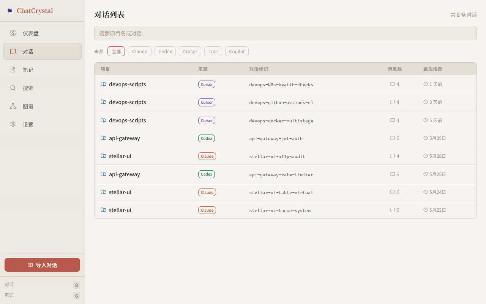
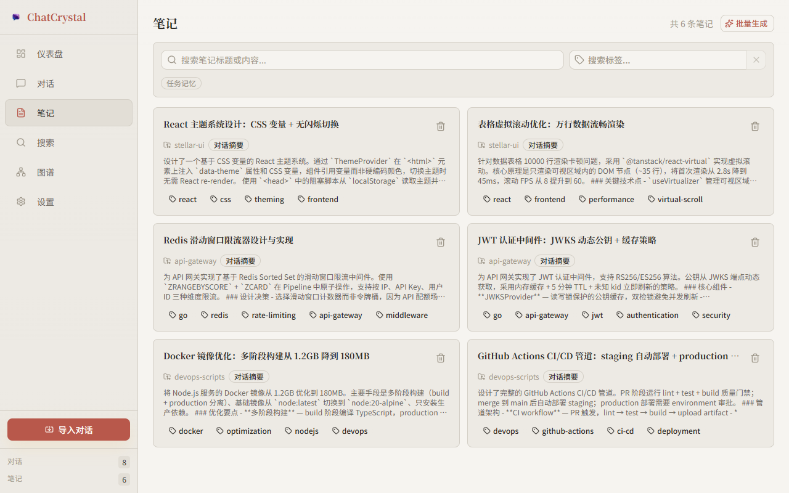
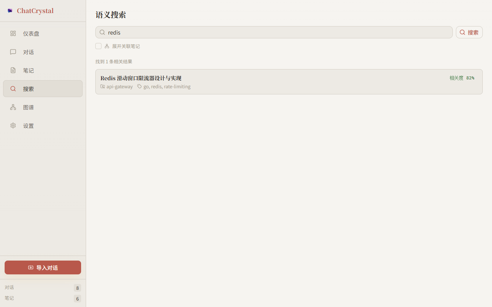
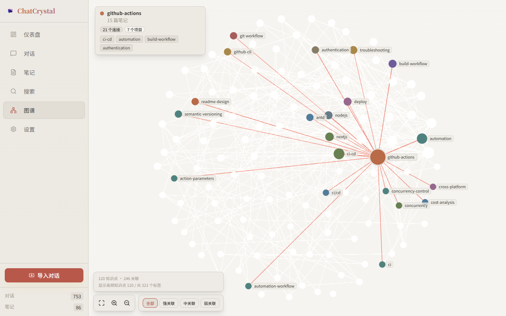

<div align="center">


# ChatCrystal

**面向 AI 编程对话的本地优先 PKM**

[](https://github.com/ZengLiangYi/ChatCrystal/releases)
[](https://www.npmjs.com/package/chatcrystal)
[](https://glama.ai/mcp/servers/ZengLiangYi/ChatCrystal)
[](LICENSE)
[](https://nodejs.org/)
[](#)
[](https://zengliangyi.github.io/ChatCrystal/zh/)

[官网](https://zengliangyi.github.io/ChatCrystal/zh/) ·
[下载桌面版](https://github.com/ZengLiangYi/ChatCrystal/releases) ·
[npm](https://www.npmjs.com/package/chatcrystal) ·
[文档](docs/USER_GUIDE.zh-CN.md) ·
[English](README.md)

</div>

---

<div align="center">

</div>

<br>

ChatCrystal 是一个本地优先的 AI PKM / 个人知识管理工具，面向每天使用 Claude Code、Cursor、Codex CLI、Trae、GitHub Copilot 解决问题的开发者。

它会把散落在 AI 编程工具里的对话沉淀为结构化笔记、语义搜索、标签知识图谱、Markdown 备份和可供 Agent 复用的 MCP 记忆。如果它也解决了你的工作流痛点，Star 可以帮助更多开发者发现这种私有、本地优先的 AI 工作记忆方式。

## 快速开始

### 桌面应用（推荐）

从 [GitHub Releases](https://github.com/ZengLiangYi/ChatCrystal/releases) 下载最新 Windows 安装包。安装后启动 ChatCrystal，在设置页配置 LLM 和 Embedding Provider，然后点击 **Import**。

### CLI / Web

```bash
npm install -g chatcrystal
crystal serve -d
crystal import
```

然后在浏览器打开 http://localhost:3721。

### Docker 云端部署

想把 ChatCrystal 自托管给多台设备使用？完整说明见后文的 [Docker 云端部署](#docker-云端部署-1)。

## 它能做什么

- **导入 AI 编程对话**，从本地工具数据目录扫描历史记录。
- **提炼结构化笔记**，包含标题、摘要、结论、代码片段和标签。
- **语义搜索知识**，支持 Embedding 检索和关联笔记扩展。
- **构建知识点图谱**，以 tag 作为知识点节点，用归一化共现关系连接相关知识点。
- **提供 CLI 与 MCP 工具**，让 Agent 能召回经验并写回可复用成果。
- **本地运行**，LLM 与 Embedding Provider 可独立配置。

## 截图

<div align="center">
<table>
<tr>
<td align="center"><strong>对话浏览</strong></td>
<td align="center"><strong>笔记摘要</strong></td>
</tr>
<tr>
<td></td>
<td></td>
</tr>
<tr>
<td align="center"><strong>语义搜索</strong></td>
<td align="center"><strong>知识图谱</strong></td>
</tr>
<tr>
<td></td>
<td></td>
</tr>
</table>
</div>

## 常用命令

```bash
crystal status                          # 服务器状态与数据库统计
crystal import [--source claude-code]   # 扫描并导入对话
crystal search "关键词" [--limit 10]     # 语义搜索
crystal notes list [--tag 标签名]        # 浏览笔记
crystal notes get <id>                  # 查看笔记详情
crystal summarize --all                 # 批量生成摘要
crystal config get                      # 查看配置
crystal serve -d                        # 后台启动服务器
crystal serve stop                      # 停止后台服务器
crystal mcp                             # 启动 MCP stdio 服务
```

## 文档

| 主题 | English | 简体中文 |
|---|---|---|
| 用户指南 | [docs/USER_GUIDE.md](docs/USER_GUIDE.md) | [docs/USER_GUIDE.zh-CN.md](docs/USER_GUIDE.zh-CN.md) |
| 开发者指南 | [docs/DEVELOPMENT.md](docs/DEVELOPMENT.md) | [docs/DEVELOPMENT.zh-CN.md](docs/DEVELOPMENT.zh-CN.md) |
| MCP 与 Agent | [docs/MCP.md](docs/MCP.md) | [docs/MCP.zh-CN.md](docs/MCP.zh-CN.md) |
| 经验质量门槛 | [docs/EXPERIENCE_GATE.md](docs/EXPERIENCE_GATE.md) | [docs/EXPERIENCE_GATE.zh-CN.md](docs/EXPERIENCE_GATE.zh-CN.md) |
| Agent Skills | [docs/agent-skills.md](docs/agent-skills.md) | [docs/agent-skills.zh-CN.md](docs/agent-skills.zh-CN.md) |

## 运行要求

- Node.js >= 20
- 用于摘要生成的 LLM Provider
- 用于语义搜索的 Embedding Provider

LLM 和 Embedding 需要分别配置。Claude、GPT、Qwen 等大语言模型不是 Embedding 模型。Provider 示例见[用户指南](docs/USER_GUIDE.zh-CN.md#配置)。

ChatCrystal 已将 [OrcaRouter](https://www.orcarouter.ai/ref/ref_67516d927343232775e2) 作为一等 LLM Provider 集成。OrcaRouter 兼容 OpenAI API，Base URL 已内置；用户只需填写 API Key，即可在 **Settings** 中获取并选择可用模型。

## 本地开发

```bash
git clone https://github.com/ZengLiangYi/ChatCrystal.git
cd ChatCrystal
npm install
npm run dev
```

开发服务端口：

- API/server: http://localhost:3721
- Vite client: http://localhost:13721

架构、测试、构建和发布说明见[开发者指南](docs/DEVELOPMENT.zh-CN.md)。

## Docker 云端部署

默认 Compose 只运行 ChatCrystal 一个服务。数据保存在 `chatcrystal-data` volume 中，并挂载到容器内 `/data`。

```bash
git clone https://github.com/ZengLiangYi/ChatCrystal.git
cd ChatCrystal
docker compose up -d
```

默认 `docker-compose.yml` 会从 GitHub Container Registry 拉取 `ghcr.io/zengliangyi/chatcrystal:latest`。如果要固定已发布版本，设置 `CHATCRYSTAL_IMAGE_TAG`。如果要从源码本地构建，使用 `docker compose -f docker-compose.yml -f docker-compose.build.yml up -d --build`。

如果要更新已有 Docker 部署，运行 `docker compose pull && docker compose up -d`。维护者注意：GHCR 首次发布后，需要在 GitHub Packages 中将 `ghcr.io/zengliangyi/chatcrystal` 设为 Public；发布 workflow 会验证匿名拉取权限，未公开时不会通过。

Compose 默认绑定到宿主机 `0.0.0.0:3721`，这样局域网设备可以通过宿主机 IP 访问云端核心。如需调整宿主机端口，设置 `CHATCRYSTAL_HOST_PORT`；如果只想让本机反向代理访问，可设置 `BIND_ADDRESS=127.0.0.1`。如果要公网访问，请在前面放一个 HTTPS 反向代理，并让 CLI / 浏览器连接 HTTPS 地址。不要让 bearer token 走明文 HTTP。

在 Windows Docker Desktop 上，published port 可能仍需要额外宿主机网络配置，才能通过宿主机局域网 IP 访问。云端模式测试时，请先在客户端设备上验证 `http://<host-ip>:<host-port>/api/health` 是否能连通；如果不能连通，需要配置 Windows 端口转发/防火墙规则，或把云端核心部署到真正的远程主机。

首次启动且没有设置 `CHATCRYSTAL_API_TOKEN` 时，打开 Web UI，输入容器日志或 `/data/setup-code` 中的 setup code，然后设置一个供所有设备共享的 API token。

Docker 云端 token 的轮换和重置方式如下：

```bash
# 如果还知道当前 token，可以在线轮换。
crystal --base-url https://chatcrystal.example.com token rotate "new-long-token-at-least-16-chars" --current "old-token"
crystal connect https://chatcrystal.example.com --token "new-long-token-at-least-16-chars"

# 如果忘记 token，且没有设置 CHATCRYSTAL_API_TOKEN，可以在容器内重置 stored auth。
docker compose exec chatcrystal crystal token reset --yes
docker compose logs chatcrystal --tail=80
docker compose exec chatcrystal cat /data/setup-code
```

如果部署时设置了 `CHATCRYSTAL_API_TOKEN`，实际生效的 token 来自环境变量，而不是 `/data/auth.json`。这时需要修改 `.env` 或 Compose 环境变量，然后用 `docker compose up -d --force-recreate` 重建容器。

如果使用已有 Ollama 或外部 API，可在 Web UI 或环境变量中配置 provider URL。在 Docker 中，`localhost` 指向容器内部；Compose 场景请用 `CHATCRYSTAL_DOCKER_LLM_BASE_URL` 和 `CHATCRYSTAL_DOCKER_EMBEDDING_BASE_URL` 覆盖 provider URL。Docker Desktop 上访问宿主机 Ollama 可用 `http://host.docker.internal:11434`，也可以使用远程 HTTPS / OpenAI-compatible API。

### 从本机设备导入到云端实例

在保存 Claude Code、Cursor、Codex CLI、Trae 或 GitHub Copilot 历史记录的设备上安装或运行 CLI：

```bash
crystal connect https://chatcrystal.example.com --token "your-long-token"
crystal import --yes
```

CLI 会在本机扫描并解析历史记录，然后把标准化后的对话上传到云端。云端不会扫描你的本机文件系统。导入的对话不会自动生成摘要；准备好后再通过 Web UI 或 `crystal summarize --all` 批量生成。默认情况下，CLI 会拒绝把 ChatCrystal API token 发送到非本机 `http://` 地址；云端访问请使用 HTTPS。

## 联系我


## License

[Apache License 2.0](LICENSE)
